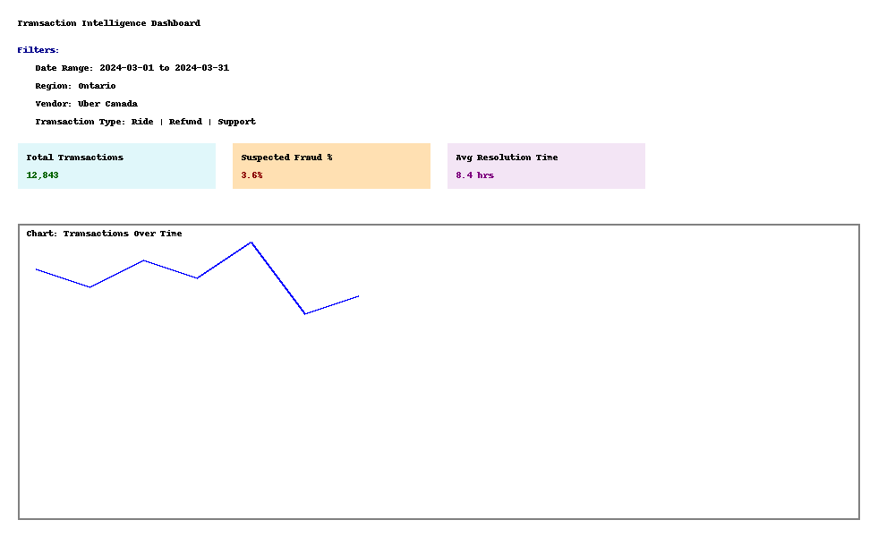

# 📊 Scalable Text & Transaction Intelligence System

A non-LLM analytics pipeline that transforms raw documents and transactional records into structured insights, enabling fraud detection, forecasting, classification, and real-time monitoring. Designed for scalable environments like rideshare, e-commerce, and financial operations.

---

## 🚀 Key Features

- 🧾 Extracts key fields (dates, prices, vendors) from receipts, logs, contracts
- 📍 Named entity recognition (NER) for org names, locations, references
- 📂 ML-based document classification: SVM, logistic regression
- 📈 Statistical forecasting (ARIMA, Holt-Winters) for tickets & transactions
- 🎯 Bootstrapped fraud risk scoring with confidence intervals
- 🧪 Bayesian & sequential A/B testing for promos, pricing, UI changes
- 📉 GLM & mixed-effects models to analyze churn, fraud, resolution time
- 🔄 Python ETL pipeline with audit/versioning
- 📊 AWS QuickSight dashboard for regional and transactional KPIs

---

## 📂 Project Structure

```
transaction-intel-system/
├── data/
│   ├── raw_documents/            # Sample invoices, logs, receipts
│   └── processed_outputs/        # Parsed JSON or CSV
├── etl_pipeline/
│   ├── parse_fields.py           # Regex + rule-based parsers
│   ├── ner_extractor.py          # spaCy-based NER pipelines
│   └── etl_loader.py             # Data cleaning + SQL ingestion
├── modeling/
│   ├── document_classifier.py    # ML models (SVM, logreg)
│   ├── forecasting.py            # ARIMA, Holt-Winters
│   ├── ab_testing.py             # Bayesian & sequential test logic
│   └── fraud_analysis.py         # GLM, bootstrapping, risk modeling
├── dashboards/
│   └── quicksight_config/        # Filters, views, metrics
├── notebooks/
│   └── exploratory_demo.ipynb    # E2E test case demo
├── requirements.txt
└── README.md
```

---

Made with ❤️ by Rahul Chatterjee

---

## 📊 Dashboard Preview


